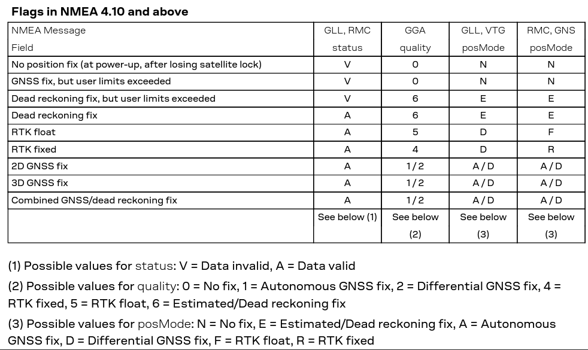
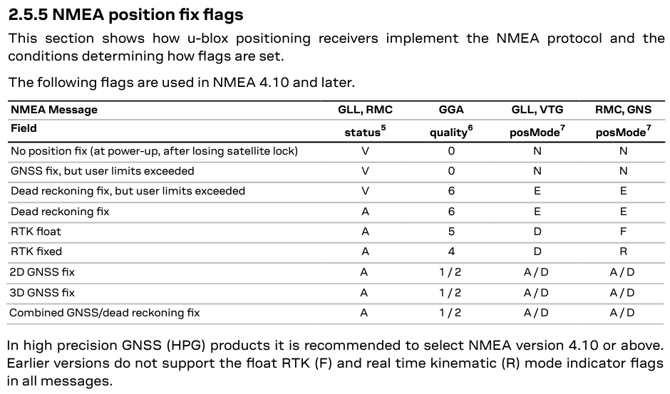

## GPX Ideas - fixType

### Background

It has been proposed that the list of fix types be extended.

Discussion in the GPX developer group - [link](https://groups.io/g/gpx/topic/fixtype_and_enumerations_in/101760074)

### Enumerations

Current values:

| Value | Description                                    |
| ----- | ---------------------------------------------- |
| none  | Fix not available                              |
| 2d    | 2D GNSS fix                                    |
| 3d    | 3D GNSS fix                                    |
| dgps  | Differential GPS / GNSS fix                    |
| pps   | Precise positioning service - secure P(Y) code |

Proposed additions, alternative text can be considered:

| Value | Alternatives                  | Description                                          |
| ----- | ----------------------------- | ---------------------------------------------------- |
| dr    | dead_recko                    | Dead reckoning / estimated                           |
| float | rtk_float                     | Real-time kinematic (RTK) - floating point solution  |
| ins   |                               | GNSS + dead reckoning - INS                          |
| man   | manual                        | Manual input - fixed position                        |
| ppp   |                               | Precise point positioning (PPP)                      |
| rtk   | rtk_int / rtk_fixed / rtk_fix | Real-time kinematic (RTK) - fixed / integer solution |
| sim   | simul                         | Simulation                                           |

Notes:

- PPP is rarely mentioned in receiver documentation and often indistinguishable from 2D / 3D, DGPS or RTK
- Should PPK (equivalents of RTK float and fixed) be added to the list?

### References

#### GGA quality indicator

| Quality | Trimble | u-blox | NovAtel | Description                                                  |
| :-----: | ------- | ------ | ------- | ------------------------------------------------------------ |
|    0    | Y       | Y      | Y       | Fix not available or invalid                                 |
|    1    | Y       | Y      | Y       | 2D or 3D fix Converging PPP (NovAtel TerraStar-L)       |
|    2    | Y       | Y      | Y       | Differential GPS / GNSS fix - e.g. base station or SBAS (e.g. WAAS or EGNOS) Converged PPP (NovAtel TerraStar-L) Converging PPP (NovAtel TerraStar-C, TerraStar-C PRO, TerraStar-X) |
|    3    | Y       | -      | -       | Precise Positioning Service (PPS) - secure P(Y) code         |
|    4    | Y       | Y      | Y       | RTK fixed / integer solution                                 |
|    5    | Y       | Y      | Y       | RTK floating point solution Converged PPP (NovAtel TerraStar-C, TerraStar-C PRO, TerraStar-X) |
|    6    | Y       | Y      | Y       | Estimated / dead reckoning - e.g. INS                        |
|    7    |         | -      | Y       | Manual input - fixed position                                |
|    8    |         | -      | Y       | Simulation                                                   |
|    9    |         | -      | Y       | SBAS - WAAS (NovAtel receivers)                              |

Links

- [NMEA revealed](https://gpsd.gitlab.io/gpsd/NMEA.html#_gga_global_positioning_system_fix_data)
- [Trimble](https://receiverhelp.trimble.com/alloy-gnss/en-us/NMEA-0183messages_GGA.html)
- [NovAtel](https://docs.novatel.com/OEM7/Content/Logs/GPGGA.htm)
- [Lefebure](http://lefebure.com/articles/nmea-gga/)

#### FAA mode indicator

| Mode | Trimble | u-blox | NovAtel | Description                                                  |
| :--: | :-----: | :----: | ------- | ------------------------------------------------------------ |
|  A   |    Y    |   Y    | Y       | Autonomous - 2D or 3D                                        |
|  C   |    -    |   -    | -       | Quectel Querk, "Caution"                                     |
|  D   |    Y    |   Y    | Y       | Differential mode - e.g. base station or SBAS (e.g. WAAS or EGNOS) |
|  E   |    Y    |   Y    | Y       | Estimated / dead-reckoning                                   |
|  F   |    -    |   Y    | -       | RTK floating point solution                                  |
|  M   |    Y    |   -    | Y       | Manual input                                                 |
|  N   |    Y    |   Y    | Y       | Data Not Valid                                               |
|  P   |    -    |   -    | -       | Precise - presumably P(Y) code?                              |
|  R   |    -    |   Y    | -       | RTK Integer solution                                         |
|  S   |    Y    |   -    | -       | Simulation                                                   |
|  U   |    -    |   -    | -       | Quectel Querk, "Unsafe"                                      |

Links

- [NMEA Revealed](https://gpsd.gitlab.io/gpsd/NMEA.html#_sentence_mixes_and_nmea_variations)
- [Trimble](https://receiverhelp.trimble.com/alloy-gnss/en-us/NMEA-0183messages_VTG.html)
- [NovAtel](https://docs.novatel.com/OEM7/Content/Logs/GPVTG.htm)

#### u-blox

u-blox M8 [protocol specification](https://content.u-blox.com/sites/default/files/products/documents/u-blox8-M8_ReceiverDescrProtSpec_UBX-13003221.pdf) section 31.1.6:

u-blox F9 [protocol specification](https://content.u-blox.com/sites/default/files/documents/u-blox-F9-HPG-1.32_InterfaceDescription_UBX-22008968.pdf) section 2.5.5:

