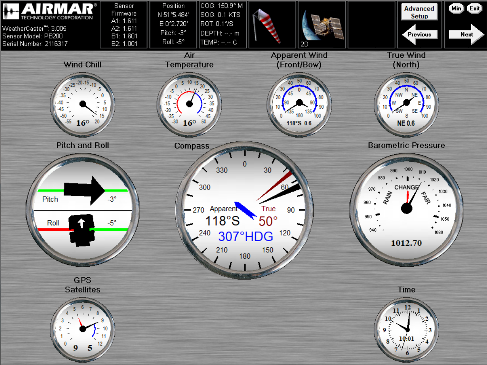

## GPX Extensions

### Weather Station

#### Overview

Weather stations tend to combine data from a GPS / GNSS, IMU and meteorological instruments. They typically output the data as NMEA 0183 sentences.




Example of a weather station (see above) using GPX extensions

- gpx_pvt - cog + sog
- gpx_imu - hdg, rot, pitch, roll
- gpx_sea - awa, aws
- gpx_met - gwd, gws, atemp, wtemp, baro, hum


#### Trackpoint

n.b. This GPX example does not correspond to the image above.

```xml
<trkpt lat="50.5710623" lon="-2.4563484">
  <ele>1.90</ele>
  <time>2022-04-11T10:16:01Z</time>
  <sats>29</sats>
  <extensions>
    <pvt:ext>
      <pvt:cog>157.19</pvt:cog>
      <pvt:sog>0.542</pvt:sog>
    </pvt:ext>
    <imu:ext>
      <imu:hdg>275.23</imu:hdg>
      <imu:rot>3.98</imu:rot>
      <imu:roll>1.25</imu:roll>
      <imu:pitch>1.15</imu:pitch>
    </imu:ext>
    <sea:ext>
      <sea:awa>20.15</sea:awa>
      <sea:aws>4.23</sea:aws>
    </sea:ext>
    <met:ext>
      <met:atemp>15.37</met:atemp>
      <met:wtemp>6.89</met:wtemp>
      <met:gwd>20.46</met:gwd>
      <met:gws>4.67</met:gws>
      <met:baro>1013.89</met:baro>
      <met:hum>89.23</met:hum>
    </met:ext>
  </extensions>
</trkpt>
```


