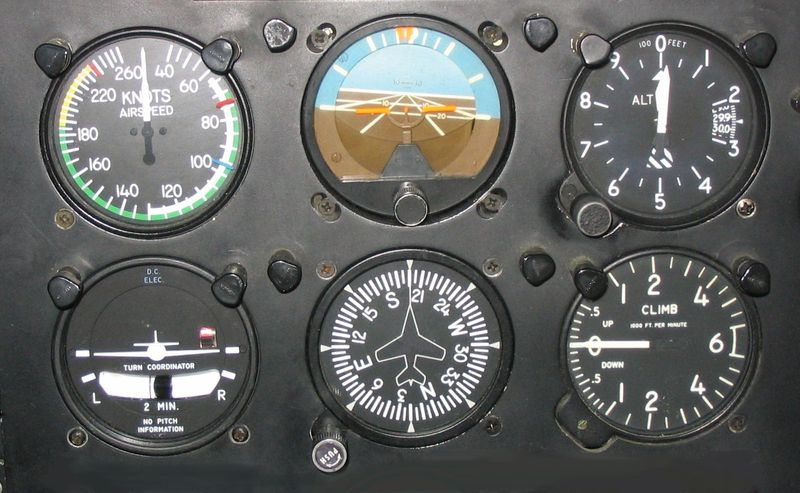

## GPX Extensions

### Air / Aviation - gpx_air

#### Overview

Air / aviation elements include the various types of airspeed and the various types of elevation / altitude / height.

They apply to all sorts of flight related activities; balloons, hang gliders, microlights, gliders, light aircraft, jet aircraft, drones and helicopters.

| Name                         | Values       | Description                                                  |
| ---------------------------- | ------------ | ------------------------------------------------------------ |
| `<ias>`                      | >= 0         | Indicated airspeed (IAS) is measured by a pitot-static system in meters per second (m/s) |
| `<cas>`                      | >= 0         | Calibrated airspeed is the indicated airspeed adjusted for pitot system position and installation error in meters per second (m/s) |
| `<eas>`                      | >= 0         | Equivalent airspeed is the calibrated airspeed adjusted for compressibility effects in meters per second (m/s). It is closely related to Mach number and can therefore be directly calculated using pressure differences. EAS can be used to calculated TAS, accounting for non-standard pressure and temperature |
| `<tas>`                      | >= 0         | True airspeed (TAS) is the speed of the aircraft relative to the airmass in which it is flying in meters per second (m/s). TAS can be calculated using EAS and air density (i.e. pressure altitude and OAT, typically ignoring humidity) or from mach number + OAT |
| `<mach>`                     | >= 0         | Mach number can be calculated directly from the pitot-static system, or from TAS and OAT |
| `<ialt set="nnn" ref="xxx">` |              | Indicated altitude shows elevation / altitude / height of an aircraft in meters (m) "set" is the pressure setting / sub-scale shown in the Kollsman window in hectopascals (hPa) "ref" is the pressure reference and might be "qnh" (elevation / altitude), "qfe" (height) or "std" (pressure altitude) |
| `<palt>`                     |              | Pressure altitude is the height above the standard datum plane (SDP) in meters (m). Pressure altitude uses a pressure setting of 1013.25 hPa and is used to determine the flight level (FL) of the aircraft above MSL. |
| `<dalt>`                     |              | Density altitude is the altitude relative to standard atmospheric conditions at which the air density would be equal to the indicated air density in meters (m). Density altitude is affected by pressure, temperature and humidity. |
| `<agl>`                      |              | Height above ground level (HAGL) is the vertical distance with respect the underlying terrain in meters (m). AGL is determined by a radar / radio altimeter as opposed to a barometric altimeter. |
| `<slip>`                     | -180 to +180 | Slip / skid indicates whether the aircraft is in coordinated flight during a turn, measured in degrees (°) positive = [slip]((https://en.wikipedia.org/wiki/Slip_(aerodynamic)), negative = [skid](https://en.wikipedia.org/wiki/Skid_(aerodynamic)) |

#### Background

The “six pack” is the name given to the six main flight instruments in a cockpit. While three of the six instruments belong to the plane's pitot-static pressure system, the other three are inertial reference / gyroscopic instruments. The traditional six pack instruments are analog but they are often controlled by digital systems nowadays, or shown within [glass cockpit](https://en.wikipedia.org/wiki/Glass_cockpit) displays.

Pitot-static instruments

- The airspeed indicator (ASI) shows IAS in knots, but is sometimes capable of showing TAS as well
- The altimeter will show elevation / altitude / height in feet, depending on the setting in the Kollsman window
  - The altimeter will show pressure altitude when this setting is 1013.25 hPa / 29.92 Hg
- The vertical speed indicator (VSI) displays the rate of climb or descent (usually in feet per minute) - see [gpx_pvt](../gpx_pvt/README.md) for ROC

Gyroscopic instruments

- The attitude indicator (AI) shows the aircraft's attitude in relation to the horizon - see [gpx_imu](../gpx_imu/README.md) for pitch and roll
- The turn coordinator (TC) shows direction, rate of turn (ROT) and indicates slip / skid - see [gpx_imu](../gpx_imu/README.md) for ROT
- The heading indicator (HI) shows direction in relation to magnetic north -  see [gpx_imu](../gpx_imu/README.md) for heading

It is worth noting that a typical smart phone could realistically simulate the six pack, except for the ASI which requires dynamic pressure from the [pitot tube](https://en.wikipedia.org/wiki/Pitot_tube).

#### Summary

Without going into great detail, the following statements can be made regarding the speed and elevation / altitude / height of an aircraft:

- There are essentially 6 different types of speed for an aircraft
  - [IAS](https://en.wikipedia.org/wiki/Indicated_airspeed), [CAS](https://en.wikipedia.org/wiki/Calibrated_airspeed), [EAS](https://en.wikipedia.org/wiki/Equivalent_airspeed), [TAS](https://en.wikipedia.org/wiki/True_airspeed), [mach number](https://en.wikipedia.org/wiki/Mach_number) and [ground speed](https://en.wikipedia.org/wiki/Ground_speed) (SOG).
  - The most important speeds during flight are IAS, mach number and ground speed but the others also serve a purpose.
- There are essentially 6 different types of elevation / altitude / height for an aircraft
  - Indicated altitude or height ([QNH or QNE](https://en.wikipedia.org/wiki/Altimeter_setting)), [pressure altitude](https://en.wikipedia.org/wiki/Pressure_altitude) (STD), [density altitude](https://en.wikipedia.org/wiki/Density_altitude), absolute altitude / height ([AGL](https://en.wikipedia.org/wiki/Height_above_ground_level)) and true altitude
  - The pitot-static system and air data computer (ADC) can determine all of the above metrics, with the exception of true altitude

Whilst it is possible to do approximations after the flight, replicating the exact calculations of the air data computer (ADC) is not guaranteed.

The gpx_air extension therefore supports all types of airspeed and elevation / altitude / height for an aircraft. The only two exceptions are ground speed (SOG) and true altitude / elevation which go elsewhere in GPX files, `<pvt:sog>` and `<ele>` respectively.

#### References

Perhaps the best video reference(s) for flight instruments and flight data is a [playlist](https://www.youtube.com/playlist?list=PLJ-0SVdtegU-SS5Kp12Yw70iJbx4ApHhD) on the [Aviation Theory](https://www.youtube.com/@AviationTheory) YouTube channel.

Once you are familiar with the various flight instruments and the underlying data it is easy to find additional sources of information.

It is also worth noting that the aviation industry is looking to switch from using magnetic north to true north - [Mag2True](https://www.aerosociety.com/news/time-for-a-change-of-direction)

#### Exclusions

- IMU data such as heading, pitch, roll and rate of turn is handled by the [gpx_imu](../gpx_imu/README.md) extension
- Meteorological data is handled by the [gpx_met](../gpx_met/README.md) extension
  - `<atemp>` should be used for outside air temperature ([OAT](https://en.wikipedia.org/wiki/Outside_air_temperature)) / static air temperature (SAT) / true air temperature
    - `<atemp id="2">` can be used for total air temperature ([TAT](https://en.wikipedia.org/wiki/Total_air_temperature)) / ram air temperature (RAT) / indicated air temperature (IAT)
    - ISA temperature is redundant as it can easily be calculated (if required)
  - `<gwd>` and `<gws>` should be used for the wind direction and speed derived from COG, SOG, [heading](https://en.wikipedia.org/wiki/Heading_(navigation)) and [TAS](https://en.wikipedia.org/wiki/True_airspeed)
  - `<baro>` should be used for [static pressure](https://en.wikipedia.org/wiki/Static_pressure)
- Engine data is handled by the [gpx_eng](../gpx_eng/README.md) extension
  - e.g. tachometers, temperatures, pressures, fuel, batteries, etc
- Angle-of-attack (AOA) sensors are not included at this time
- Glide ratio / slope is not included because it can be determined from ground speed (SOG) and rate of descent (using ROC)

#### Example Usage

Air / Aviation

- [Microlight](../examples/air/microlight.md)
- [Light Aircraft](../examples/air/aircraft.md) 

