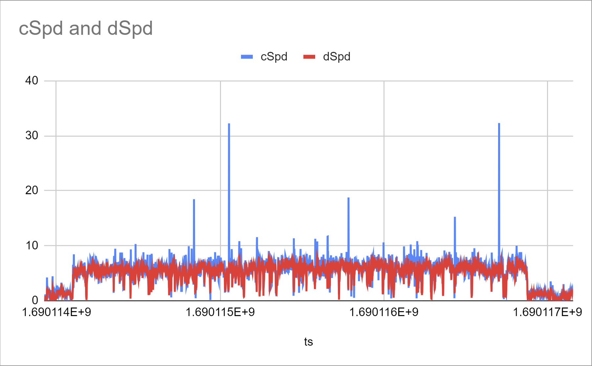

## Proposal for GPX

### Quick Introduction

This proposal is to add some useful GPS / GNSS data items to the GPX standard; e.g. "course", "speed", accuracy estimates and device information.

I've tried to be quite thorough in this article so that the benefits of this additional data are readily apparent. Apologies for the rather lengthy document.

What is included:

- This is solely about data originating from the GPS / GNSS chips in modern GPS devices and wearables.
- This is not about data originating from other sensors (e.g. accelerometers, electronic compasses, heart rate monitors, thermometers, etc).
- This is unrelated to any previous proposal(s) to incorporate existing extensions into the GPX standard (e.g. heart rate, temperature, etc).

Notes about interoperability and compatibility with existing software and existing GPX files:

- The inclusion of "course" and "speed" are entirely consistent / compatible with GPX 1.0.
- The other data items (e.g. accuracy estimates) have been added in such a way as to ensure forwards and backwards compatibility with GPX 1.1.
- There is no obligation for companies to change their existing products or software, but they do have the option to adopt the new format very easily.

### Overview of GPS / GNSS

It is perhaps worth quickly summarising the inner workings of a GPS / GNSS receiver in order for the significance of course and speed to be appreciated.

The GPS / GNSS chipset is essentially responsible for producing a PVT (position + velocity + time) solution at regular intervals. This is typically once every second but sometimes more frequently (e.g. 5 Hz, 10 Hz, 20 Hz or 25 Hz).

The overall process can be summarised as two separate steps:

1. Determination of raw "observables" for each satellite. This occurs during the initial signal acquisition and during the subsequent tracking:
   - **Pseudo-range** corresponds to the distance from the receiver antenna to the satellite antenna, including receiver and satellite clock offsets and other biases.
   - **Carrier phase** is a measurement of the beat frequency between the received carrier of the satellite signal and a receiver-generated reference frequency.
   - **Doppler shift** is the change in frequency for the receiver antenna moving relative to the satellite antenna.
2. Determination of a PVT solution from the raw "observables" obtained during the first step:

   - **Position and time** are derived primarily from the **pseudo-range** observables via [trilateration](https://en.wikipedia.org/wiki/Trilateration).

   - **Course** over ground (COG) and **speed** over ground (SOG) are derived from a 3D velocity, (typically) derived from the **doppler shift** observables.

The important point to highlight is that GPS / GNSS chipsets do not calculate velocity / speed from the positional data. In essence, position and velocity are calculated independently and speeds derived from the doppler shift observables are far more accurate / robust than speeds derived from positional data.

### Doppler-derived Speed

The image below shows a kitesurfing track from an Apple Watch SE. It illustrates the difference between speeds (m/s) derived from positional data (cSpd, blue) vs the Doppler-derived speeds (dSpd, red). There has been no filtering or post-processing applied to any of the data and the spikes in the position-derived speeds (cSpd, blue) are very apparent. The Doppler-derived speeds will typically be far more robust / resilient than position-derived speeds and they are far less susceptible to large spikes.

The high accuracy of Doppler-derived speeds from GNSS receivers has been known to the [GPS Speedsurfing](https://www.gps-speedsurfing.com/) community for a long time.

A couple of articles were written in 2007 whilst initially studying the Doppler-derived speeds produced by the [Locosys](https://www.locosystech.com/en/product/gps-handheld-data-logger-gt-31.html) GT-11 (SiRF Star II chipset):

- [High accuracy speed measurement using GPS](https://studylib.net/doc/18795194/high-accuracy-speed-measurement-using-gps) by Tom Chalko PhD

- [Handheld-GPS based Speed-Measurements](https://web.archive.org/web/20120531035620/http://www.gps-results.com/GPS_Speed.pdf) by Manfred Fuchs PhD

Official times / speeds of world record attempts at the annual [Luderitz Speed Challenge](https://luderitz-speed.com/) use video timing. However, GPS / GNSS times from custom devices such as the [Motion GPS](https://www.motion-gps.com/) are typically +/- 0.05 knots of the official video-timed results over the 500m course.

It's worth noting that the majority of the speedsurfing community use custom devices (e.g. [Motion GPS](https://www.motion-gps.com/)) which output their data in a binary format, including the Doppler-derived speed and speed accuracy estimate. However, with the advent of 3rd party apps for smart phones and watches it makes a lot of sense to support Doppler-derived speeds and the various accuracy estimates to be included in "standard" GPX files.

### Speed in Sport

A number of sports and activities already benefit from the Doppler-derived speeds output by GPS / GNSS receivers.

- Speedsailing - custom devices (e.g. [Motion GPS](https://www.motion-gps.com/)) and watch / phone apps (e.g. [Waterspeed](https://waterspeedapp.com/) and [WindsportTracker](https://www.windsporttracker.com/))
- Regatta racing - custom devices (e.g. [Sailmon](https://sailmon.com/) or [Vakaros](https://vakaros.com/)) which are used for live tracking (e.g. world championships, olympics, etc)
- Sky diving - custom devices (e.g. [Flysight](https://www.flysight.ca/)) for glide statistics, etc.
- Motorsport - custom devices (e.g. [Dragy](https://dragymotorsports.co.uk/), [VBOX Sport](https://www.vboxmotorsport.co.uk/index.php/en/vbox-sport), [P-GEAR](https://pgearmotorsports.com/)) for things like 1/4 mile speeds and 0-60 mph times.
- Land speed records - on-board speedometer (e.g. [Bloodhound SSC](https://www.bloodhoundlsr.com/) which uses a custom version of the [Motion GPS](https://www.motion-gps.com/))

The devices listed above will export the Doppler-derived speeds (and accuracy estimates) when using their proprietary binary formats, or CSV files. Since there is no "standard" way to record the Doppler-derived speeds in GPX 1.1 compliant files, it often leads to important data items being discarded or lost when using GPX files.

It should be noted that numerous other sports can potentially benefit from Doppler-derived speeds from phone and watch apps. For example:

- Cycling
- Skiing
- Snowboarding

The speed output by a GPS / GNSS receiver is slightly less useful when worn on a wrist that is constantly "swinging" (e.g. walking, running, SUP, etc).

### History of GPX 1.1

GPX 1.0 was released in 2002 as a light-weight XML data format for the interchange of GPS data.

GPX 1.1 was released on 9 August 2004 and improved upon the existing GPX 1.0 standard. Notable changes were the introduction of `<extensions>` and a number of existing elements that were previously under `<gpx>` were that were tweaked and moved into the `<metadata>` element.

Waypoints, routes and tracks were largely unchanged in GPX 1.1, aside from `<url>` elements being replaced by `<link>` elements and the introduction of `<extensions>`. However, `<course>` and `<speed>` were inadvertently dropped from the `<trkpt>` elements.

The majority of software that can import GPX 1.0 files can also import GPX 1.1 files since they are so similar. If `<course>` and `<speed>` are included in GPX 1.1 files they are typically recognised by software that already supports them in GPX 1.0 files.

### GPX 1.1 Extensions

#### Garmin Extensions

Garmin have released a number of extension schemas for GPX 1.1 over the years, initially including "GpxExtensions" (see [v2](https://www8.garmin.com/xmlschemas/GpxExtensionsv2.xsd) and [v3](https://www8.garmin.com/xmlschemas/GpxExtensionsv3.xsd)).

The GpxExtensions schema was subsequently split up into separate extensions, e.g. TrackPointExtension (see [v1](https://www8.garmin.com/xmlschemas/TrackPointExtensionv1.xsd) and [v2](https://www8.garmin.com/xmlschemas/TrackPointExtensionv2.xsd)).

It is notable that TrackPointExtension v2 (circa 2015) introduced `<speed>`, `<course>` and `<bearing>`, providing a "proper" way to include course and speed in GPX 1.1 files.

Sadly, adoption of TrackPointExtension v2 for `<course>` and `<speed>`  in GPX 1.1 files is not evident for the big brands; Garmin, Suunto, COROS, etc.

#### TrackPointExtras (TPX)

The [TPX](../../xmlschemas/tpx/1/0/README.md) schema was created in July 2023, primarily for sports and activities that depend upon course, speed and accuracy estimates (see [v1.0](../../xmlschemas/tpx10.xsd)).

The extension schema includes `<course>`, `<speed>`, `<roc>` (rate of climb), plus various accuracy estimates for use within `<trkpt>` `<extensions>`.

It also includes additional `<src>` information such as `<manufacturer>`, `<product>`, `<serial>`, `<version>`, `<appname>` and `<appver>`.

### Issues with GPX 1.1 and Extensions

One of the issues with the use of extensions for common elements such as `<course>` and `<speed>` is the lack of consistency:

- Most applications do not include `<course>` and `<speed>` in their GPX exports. This includes big brands such as Garmin, Suunto and COROS.
- Some applications include `<course>` and `<speed>` in the `<trkpt>` elements (not `<extensions>`) which is helpful, but it is not GPX 1.1 compliant.
- Some applications make use of `<extensions>` but often refer to non-existent or undeclared schemas / namespaces - e.g. `<gpxdata:speed>`
- Few (if any) applications use Garmin's TrackPointExtension V2 schema to include `<course>` and `<speed>` in GPX 1.1 files.
- To add further confusion, some apps generate multiple variations of GPX files such as Waterspeed which currently offers 4 different options!

I wrote about the [GPX format](../README.md) and provided further details about [speed in GPX files](../speed.md) earlier in 2023, whilst investigating GPX compatibility issues affecting the speedsurfing community.

### Enhancements to GPX 1.1

Shortly after drafting the [TrackPointExtras](../../xmlschemas/tpx/1/0/README.md) schema, I started to contemplate whether it should actually become part of the GPX standard.

It is very easy for developer to overlook the importance of Doppler-derived speed provided by GPS / GNSS chips, since it is not part of the GPX 1.1 standard. The natural inclination is to assume that it can be re-created from the positional data. I've touched on this topic earlier in this document.

This proposal is pretty simple, basically to incorporate the extensions from the TrackPointExtras schema into the existing GPX 1.1 schema:

- Re-introduce `<course>` and `<speed>`, fully compatible with GPX 1.0.
- Introduce the accuracy estimates provided by numerous chipsets and [location](../../apis/location.md) services (e.g. Apple and Android). **\***
- Additional source information; `<manufacturer>`, `<product>`, `<serial>`, `<version>`, `<appname>` and `<appver> in ` `<src>` elements.
- There is an argument for calling this GPX 1.1.1 as there are absolutely no breaking changes / compatibility issues with GPX 1.1.

**\*** - what the accuracy estimates actually represent and their applications is outside of the scope of this document. Suffice to say, they typically represent the likely error (+/-) in terms or RMS, or 1-sigma / 68% (and sometimes, 3-sigma / 99.7%). They are device dependent, hence the additional `<src>` source information in this proposal.

### Example Schema for GPX 1.1.1

I have created and example schema for discussion purposes:

- The example schema is available on [GitHub](https://github.com/Logiqx/gps-wizard/blob/main/docs/xmlschemas/gpx/proposal.xsd) but as stated, it is simply a proposal and should not be used for anything other than general discussion.
- The proposal incorporates the [TrackPointExtras](../../xmlschemas/tpx/1/0/README.md) into GPX 1.1, with slimmed down the comments in keeping with the existing GPX 1.1 schema.

After further discussion on the [GPX developers forum](https://groups.io/g/gpx) (and subsequent tweaking), the GPX 1.1.1 schema would also benefit from consistent use of whitespace, which is currently a mix of tabs and spaces.

### Compatibility of GPX 1.1.1

It is important to emphasise that existing files that are already GPX 1.1 compliant will also be GPX 1.1.1 compliant.

Existing software will therefore be able to load / import GPX 1.1.1 files without any issues:

- Software that recognises `<course>` and `<speed>` in GPX 1.0 files will also recognise them in GPX 1.1.1 files.
- Software that recognises `<src>` elements will also recognise them fine in GPX 1.1.1 due to the use of mixed content.
- Existing software does not appear to rely upon the GPX version being either "1.0" or "1.1", so far as I have been able to determine.

Preliminary GPX 1.1.1 testing was successful in several applications. Both `<course>` and `<speed>` were loaded successfully into the following speedsurfing applications, plus Strava:

- [GPSResults](https://www.gps-speed.com/)
- [GpsarPro](http://gpsactionreplay.free.fr/)
- [GPS Speedreader](https://ecwindfest.org/GPS/GPSSpeedreader.html)
- [Strava](https://strava.com/)

n.b. Strava does not (currently) make use of the `<speed>` elements in GPX files and simply calculates speed from positional data. This results in large inconsistencies with sessions posted to websites such as [GPS-Speedsurfing.com](https://www.gps-speedsurfing.com/) or [GPS Team Challenge](https://www.gpsteamchallenge.com.au/). The difference in approach typically boosts max speeds and results in more frequent reporting of large spikes.

### Summary of GPX 1.1.1

The GPX 1.1.1 proposal has been described at some length but can be summarised as follows:

- Addition of `<course>`, `<speed>` in a way that is consistent with GPX 1.0.
  - Most existing software that can utilise `<course>` and `<speed>` in GPX 1.0 files will automatically utilise them in GPX 1.1.1.
- Addition of accuracy estimates in a way that is consistent with GPX 1.0 and 1.1 items such as "horizontal dilution of precision", etc.
  - Accuracy estimates will not interfere with existing apps but can be obviously used by applications that understand their meaning / utility.
- Addition of device / source information via the existing `<src>` elements.
  - Use of [mixed content](https://www.w3schools.com/xml/schema_complex_mixed.asp) ensures forwards and backwards compatibility with existing software and applications.
- Existing GPX 1.1 compliant files are also GPX 1.1.1 compliant, simply by changing the `<gpx>` attributes (e.g. schema and version).
  - Existing software only needs to tweak the `<gpx>` element to reflect GPX 1.1.1 if they want to start including `<course>` and `<speed>`.

So, that's just about everything in detail, perhaps more than strictly necessary.

My apologies for the total length of this proposal, but I felt it worth covering the "who, what, when, where, why, and how".

Please join the [GPX developers forum](https://groups.io/g/gpx) if you wish discuss this proposal and / or provide any feedback. Many thanks!

### References

These links are just to get people started:

- Observables
  - [GNS-SDR](https://gnss-sdr.org/docs/sp-blocks/observables/) - An open-source Global Navigation Satellite Systems software-defined receiver.
  - [European Space Agency (ESA)](https://gssc.esa.int/navipedia/index.php/GNSS_Basic_Observables) - The reference for Global Navigation Satellite Systems
- Velocity / speed
  - [InsideGNSS](https://insidegnss.com/wp-content/uploads/2018/01/marapr15-SOLUTIONS.pdf) - How does a GNSS receiver estimate velocity?