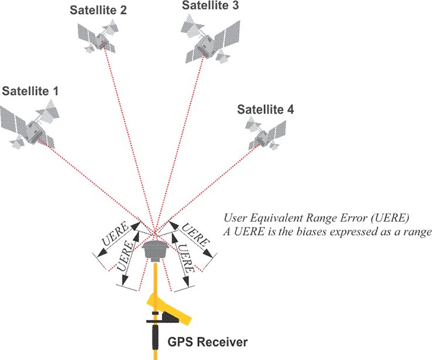

## Proposal for GPX

### Estimating Accuracy / Errors

#### Background

GPS / GNSS chipsets can often generate accuracy estimates as part of their PVT (position / velocity / time) solution.

These accuracy estimates are easily accessible nowadays, especially via the location APIs of Android and Apple devices since around 2016 / 2017.

These estimates can provide great value but there is currently no standard / agreed way to store them in a GPX 1.1 file without using extensions.

There is a great opportunity for the GPX schema to include accuracy estimates, facilitating a "standard" method for their storage and exchange.

#### PVT Solution

The GPS / GNSS chipset will typically use either [least squares](https://en.wikipedia.org/wiki/Least_squares) (LSQ) or a [Kalman filter](https://en.wikipedia.org/wiki/Kalman_filter) to determine the PVT solution.

The PVT solution will always involve a level of uncertainty, primarily because the raw [observables](https://gssc.esa.int/navipedia/index.php/GNSS_Basic_Observables) cannot provide an exact solution.

This can be illustrated visually with a diagram which shows the [UERE](https://www.e-education.psu.edu/geog862/node/1713) (user equivalent range error) for a receiver:

A simple way to think of the positional error estimate is as the UERE multiplied by the [dilution of precision](https://en.wikipedia.org/wiki/Dilution_of_precision_(navigation)) (DOP). In practice the positional accuracy estimates will probably be determined using the covariance matrix of the LSQ or Kalman [filter](https://insidegnss.com/wp-content/uploads/2018/01/marapr13-Solutions.pdf).

Note: The image above is helpful when discussing horizontal and vertical positional accuracy. Speed accuracy can be derived using a similar principle, but is dependent on the URRE (user range rate error) and the velocity method. This will typically be dependent on the stability of the doppler observable.

#### Interpretation

The accuracy estimates will typically be derived from the covariance matrix of the LSQ / Kalman filter but they do have their limitations:

- Firstly, they can ignore systemic biases which may not be easily identified
  - Such biases may not be apparent within the residuals of the LSQ / Kalman filter
- The accuracy estimates are almost certainly being produced from covariance matrix of the LSQ / Kalman filter
  - They will typically represent the amount of certainty in the final solution using 1-sigma (i.e. 68%)
- The accuracy estimates must NOT be used to infer the precise accuracy of the position / speed
  - They will however indicate when something abnormal has occurred and are very useful for software filtering
- The accuracy estimates must NOT be used to compare the accuracy of different devices
  - They are however useful within the context of single / multiple sessions from a single device

#### Effectiveness

This [study](https://www.foi.se/rest-api/report/FOI-R--3840--SE) was conducted using two u-blox 6 receivers and the content of the [GST](https://gpsd.gitlab.io/gpsd/NMEA.html#_gst_gps_pseudorange_noise_statistics) (GNSS Pseudorange Noise Statistics) message to determine the horizontal accuracy estimate (hAcc) as 1-sigma.

Blue shows the actual horizontal position error, and green shows the estimated horizontal error. Hopefully these two graphs clearly illustrate the usefulness of estimated accuracy / error without going into a lengthy study or analysis.

### Availability of Estimates

The availability of accuracy estimates can be categorised in the following ways:

- GPS / GNSS chipsets
- NMEA sentences
- Binary outputs
- Location services within the operating system - e.g. Android, iOS, iWatch, etc.

#### GPS / GNSS Chipsets

Accuracy estimates are typically available from NMEA sentences and / or binary messages being output by the GPS / GNSS chip:

The following is a list of popular chipset manufacturers who are known to produce accuracy estimates:

- Broadcom (e.g. Android smart phones and Apple watches)
- MediaTek (e.g. popular sports watches)
- Qualcomm (e.g. Snapdragon SoCs used in Android and Apple smart phones)
- Rockwell
- Samsung (e.g. Exynos SoCs used in smart phones and watches)
- Swift
- SiRF (e.g. sports watches and trackers)
- u-blox (e.g. proprietary tracking devices)

#### NMEA Sentences

Standard NMEA sentences to derive horizontal and vertical accuracy:

- [**GBS**](https://gpsd.gitlab.io/gpsd/NMEA.html#_gbs_gps_satellite_fault_detection) - GNSS Satellite Fault Detection - includes latitude, longitude, altitude errors (1-sigma)
  - This message outputs the results of the "Receiver Autonomous Integrity Monitoring" algorithm (RAIM)
- [**GST**](https://gpsd.gitlab.io/gpsd/NMEA.html#_gst_gps_pseudorange_noise_statistics) - GNSS Pseudorange Noise Statistics - includes UERE, latitude, longitude, altitude errors (1-sigma)
- [**EPE**](http://ozzmaker.com/wp-content/uploads/2016/08/M10478-M10578-NMEA_Sentence_Output.pdf) - Accuracy Estimates - Horizontal and vertical accuracy estimates - probably 1-sigma

Note: latitude / longitude accuracy estimates can be converted to horizontal accuracy using hAcc = √ (latAcc2 + lonAcc2)

Proprietary NMEA sentences:

- [**PGRME**](https://gpsd.gitlab.io/gpsd/NMEA.html#_pgrme_garmin_estimated_error) (Garmin) - Estimated Error Information - includes estimated horizontal position error (HPE) + vertical position error (VPE)
- **PSRFEPE** (SiRF) - EHPE, EVPE, EHVE, EHE
- **PUBX,0** (x-box) - Horizontal and vertical accuracy estimates (1-sigma)
- [PGLOR](https://gpsd.gitlab.io/gpsd/NMEA.html#_pglor_quectel) (Broadcom) - LSQ (Least squares) message includes HErr, AltErr, HSpdErr, VSpdErr, and TrkAngErr (RMS)
  - RMS stated in documentation but comparable to 1-sigma (68% of 1-dimension, 63% for 2-dimensions)

- [**PJLTS**](https://gpsd.gitlab.io/gpsd/NMEA.html#_pjlts_jackson_labs_time_and_3d_velocity) - Jackson Labs Time and 3D velocity includes speed accuracy estimate (1-sigma)

#### Binary Outputs

Various manufacturers are also known to provide accuracy estimates in their binary outputs:

- Rockwell - EHPE, EVPE, EHVE (1-sigma)
- Swift Navigation - hAcc, vAcc, sAcc, rAcc, cAcc (1-sigma)
- SiRF - EHPE, EVPE, EHVE
  - Locosys also provide SDOS (standard deviation of speed) and VSDOS (vertical standard deviation of speed) using SiRF chipsets (1-sigma)
- u-blox - hAcc, vAcc, sAcc, cAcc (1-sigma)

It is also likely that SoC offerings from the likes of Qualcomm and Samsung bypass NMEA by using binary protocols.

#### Location Services

Since around 2016 or 2017, accuracy estimates (including speed accuracy) have been readily available on Android and Apple devices via their [location](../../apis/location.md) services. The table below shows when the various accuracy estimates became available on Android and Apple devices.

A quick summary:

- Horizontal accuracy estimates have been available from Android and iOS since about 2008
- Speed accuracy estimates have been available from iOS / watchOS and Android since about 2016 or 2017

|         | hAcc                        | vAcc                        | sAcc                        | cAcc                        |
| ------- | --------------------------- | --------------------------- | --------------------------- | --------------------------- |
| Android | Android 1.0 (Sep 2008) | Android 8.0 (Aug 2017) | Android 8.0 (Aug 2017) | Android 8.0 (Aug 2017) |
| iOS     | iOS 2.0 (Jul 2008)     | iOS 2.0 (Jul 2008)     | iOS 10.0 (Sep 2016)    | iOS 10.0 (Sep 2016)    |
| watchOS | watchOS 2.0 (Sep 2015) | watchOS 2.0 (Sep 2015) | watchOS 3.0 (Sep 2016) | watchOS 6.2 (2020)     |

### Summary

This document provides some basic information about the various accuracy estimates available from GPS / GNSS chipsets:

- Horizontal and vertical position
- Horizontal speed, vertical speed and course

These accuracy estimates are quite widely available via NMEA sentences and binary protocols. Since around 2016 or 2017 they have also been available on Android and Apple devices, probably accounting for the majority of GPS / GNSS receivers in use today.

The majority of the available documentation refers to the estimates being 1-sigma. This level of certainty is mentioned in the Android documentation but is absent in the Apple documentation. I suspect Apple are multiplying by some factor, possibly doubling to give 2-sigma.

There is a separate page about the accuracy estimates available from the Android and Apple [location services](../../apis/location.md).

### Proposal

There is a real opportunity for adding accuracy estimates to the GPX standard so that people can make use of them when exchanging data.

The wording used in the GPX documentation is obviously a point for discussion, but I feel that values should be stored without any adjustments.

Device manufacturers may adjust the 1-sigma values (e.g. Apple), but I think the estimates are best stored as provided within the GPX file.

