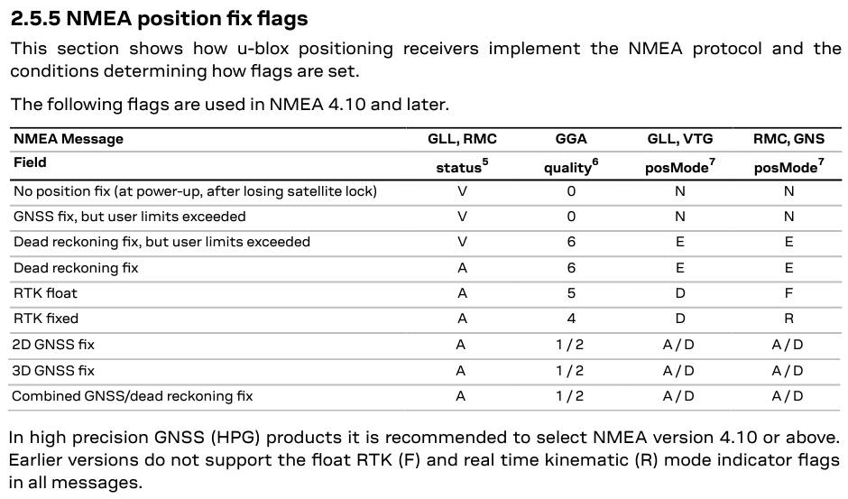

## Proposal for GPX

### Fix Type

#### Overview

It has been suggested that fixType be extended.

Current values:

| Value | Description                 |
| ----- | --------------------------- |
| none  | Fix not available           |
| 2d    | 2D GNSS fix                 |
| 3d    | 3D GNSS fix                 |
| dgps  | Differential GPS fix        |
| pps   | Precise positioning service |

Proposed additions:

| Value  | Description         |
| ------ | ------------------- |
| dr     | Dead-reckoning mode |
| float  | RTK float mode      |
| manual | Manual input mode   |
| rtk    | RTK fix mode        |
| sim    | Simulation mode     |

#### References

u-blox M8 [protocol specification](https://content.u-blox.com/sites/default/files/products/documents/u-blox8-M8_ReceiverDescrProtSpec_UBX-13003221.pdf) section 31.1.6:

u-blox F9 [protocol specification](https://content.u-blox.com/sites/default/files/documents/u-blox-F9-HPG-1.32_InterfaceDescription_UBX-22008968.pdf) section 2.5.5:

GGA [quality indicator](https://gpsd.gitlab.io/gpsd/NMEA.html#_gga_global_positioning_system_fix_data) includes 3, 7 and 8 which are not mentioned in the u-blox documentation (see above):

| Quality | Description |
| ------- | ----------- |
| 0 | Fix not available |
| 1 | GPS fix |
| 2 | Differential GPS fix (values above 2 are 2.3 features) |
| 3 | PPS fix |
| 4 | Real Time Kinematic |
| 5 | Float RTK |
| 6 | Estimated (dead reckoning) |
| 7 | Manual input mode |
| 8 | Simulation mode |

FAA [mode indicator](https://gpsd.gitlab.io/gpsd/NMEA.html#_sentence_mixes_and_nmea_variations) includes C, M, P, S and U which are not mentioned in the u-blox documentation (see above):

| Mode | Description                     |
| ---- | ------------------------------- |
| A    | Autonomous mode                 |
| C    | Quectel Querk, "Caution"        |
| D    | Differential Mode               |
| E    | Estimated (dead-reckoning) mode |
| F    | RTK Float mode                  |
| M    | Manual Input Mode               |
| N    | Data Not Valid                  |
| P    | Precise (4.00 and later)        |
| R    | RTK Integer mode                |
| S    | Simulated Mode                  |
| U    | Quectel Querk, "Unsafe"         |
