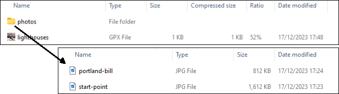

## GPZ Files

This page describing GPZ files is an adaption of the Google developers page describing [KMZ files](https://developers.google.com/kml/documentation/kmzarchives).

The main structure and wording has been retained, but the original examples have been replaced with GPX/GPZ content.

The pages describing KMZ files and GPZ files are both licensed under the [Creative Commons Attribution 4.0 License](https://creativecommons.org/licenses/by/4.0/).


### What is a GPZ File?

A GPZ file consists of a main GPX file and zero or more supporting files that are packaged using a [Zip utility](http://en.wikipedia.org/wiki/ZIP_(file_format)) into one unit, called an *archive*. The GPZ file can then be stored and emailed as a single entity. When the GPZ file is unzipped, the main *.gpx* file and its supporting files are separated into their original formats and directory structure, with their original filenames and extensions. In addition to being an archive format, the Zip format is also compressed, so an archive can include only a single large GPX file. Depending on the content of the GPX file, this process typically results in 10:1 compression. Your 10 Kbyte GPX file can be served with a 1 Kbyte GPZ file.

**Note:** For clarity, this page refers to the main GPX file within a GPZ archive as *activity.gpx*. This main GPX file can have any name, as long as it ends in *.gpx*, and as long as there is only one *.gpx* file.

You should create a GPZ file if your *activity.gpx* file is larger than 10 Kbytes, or if the *activity.gpx* file references other files (images, icons, sound files, etc).


### Recommended Directory Structure

This section provides a few simple recommendations for the creators of GPX/GPZ files. The example used in this section uses the GPX format to show the inclusion of two photos which accompany the GPX file.


Download the example *[GPZ file](example.gpz)* which contains the GPX and example photos.

**Note:** Applications should strictly enforce the following set of guidelines when resolving relative references in a GPZ file (especially see item 4 in the following list).

Follow these guidelines when creating GPZ files:

1. Create a folder that will contain the contents of your GPZ file. Give it a descriptive name (for example, *coastal-walk*).

2. Put the default GPX file (*activity.gpx*, or whatever name you want to give it) at the top level within this folder. Include only one *.gpx* file. (When applications open a GPZ file, they will scan the file, looking for the first *.gpx* file in this list. They will ignore all subsequent *.gpx* files, if any, in the archive. If the archive contains multiple *.gpx* files, you cannot be sure which one will be found first, so you need to include only one.)

3. Include one or more subfolders within the main folder to collect images, icons, sound files, or other resources referenced in the *activity.gpx* file. The complexity of this directory structure depends on the number of supporting files and your preferences for organization.

4. **Use relative references.** See "References to External Files" for more details. All relative paths begin inside the base folder described above in item 1. For example, if a GPZ file *coastal-walk.gpz* is on the desktop, and its *activity.gpx* file refers to a file *lighthouse.jpg*, which is also on the desktop, the `href` attribute of the `<link>` in the *activity.gpx* file is `../lighthouse.jpg`.

5. Do not use the *.gpz* extension for any of the subfolders within a GPZ file. The *.gpz* extension is reserved for the name of the archive itself. For example, here is the file structure of the example GPZ file:



The two photos are inside a *photos* subfolder within the main folder. If you examine the GPX file, you'll see that all of the `<link>` elements use relative references to the photos.

Here is the GPX code for one of the photo references:

```xml
<wpt lat="50.513380" lon="-2.456620">
  <desc>View from Portland Bill</desc>
  <link href="photos/portland-bill.jpg">
    <text>Portland Bill Lighthouse</text>
  </link>
</wpt>
```


### References to External Files

The *activity.gpx* file may contain a number of links to other files - images, icons, sound files, etc. The references to these files are contained in the href attribute (or sometimes, within an element such as `<license>`), which can be found in the following GPX elements:

- the `<link href>` element of `<metadata>`,  `<author>`, `<wpt>`, `<rte>`, `<rtept>`, `<trk>`, `<trkseg>`, `<trkpt>`
- the `<license>` element of `<copyright>`
- any links within `<extensions>`

These external links can be either *absolute* or *relative* references, as described in the following section. They can refer to files within the same GPZ file, or to files contained in other GPZ files or stored elsewhere on the web. Relative references are always resolved in relation to the *activity.gpx* file, as explained in the section "Resolving Relative References".


### Absolute vs. Relative References

Absolute references contain the full URL for the linked file. They are useful for files posted on a central server and are unambiguous. However, if you use absolute references to local files, the links will break when the files are moved to a new system. Relative references avoid this problem.

Here is an example of an absolute reference to a file stored on a central server:

```xml
<wpt lat="50.513380" lon="-2.456620">
  <desc>View from Portland Bill</desc>
  <link href="https://logiqx.github.io/gpx-ideas/usage/gpz/photos/portland-bill.jpg">
    <text>Portland Bill Lighthouse</text>
  </link>
</wpt>
```


### Resolving Relative References

In general, relative references are resolved in relation to the *activity.gpx* file. Any relative URL is resolved against the directory that contains this file, which is considered the root of the GPZ file. In the lighthouses example, the base URL is similar to the following (depending on where you download the GPZ file):

`lighthouses.gpx`

If you wanted to refer to a file located in a different GPZ file (for example, to *photos/fraggle-rock.jpg* contained in *another.gpz*, you would use the ".." notation to go up one level in the directory structure, which would take you out of the current GPZ file (*example.gpz*):

```xml
<link href="../another.gpz/photos/fraggle-rock.jpg">
  <text>Another Lighthouse</text>
</link>
```


**Note:** The rules for resolving relative references in a GPZ archive are based on the [RFC 3986 Section 5](https://datatracker.ietf.org/doc/html/rfc3986#section-5) standard for resolving web URLs. The base URL is determined by the location of the *activity.gpx* file, and all relative URLs are resolved in relation to that base URL.


### Creating the GPZ Archive

Use Windows Explorer or the Mac Finder to create a Zip archive. Select the contents of the folder that contains the *activity.gpx* file and related resources and choose an option such as *"WinZip > Add to Zip file ...."*. The Java JAR library also has a Zip library for programmatically creating and extracting a Zip archive, and Linux has command line versions of zip and unzip.

**Note:** When you are creating the Zip archive, be sure to select the *contents* of the folder containing the *activity.gpx* file, not the folder itself.

After you create the archive, change the *.zip* file extension to *.gpz*. To extract the files from the archive, change the *.gpz* file extension back to *.zip* and use the Zip utility to unzip the archive.
